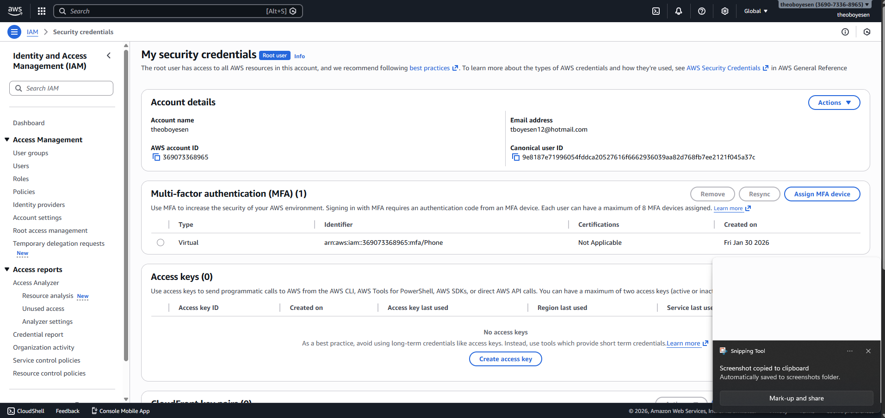
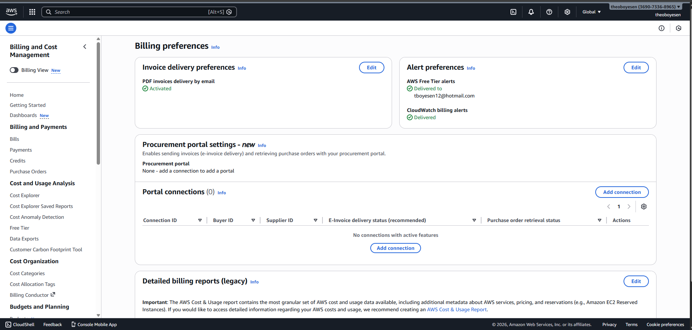
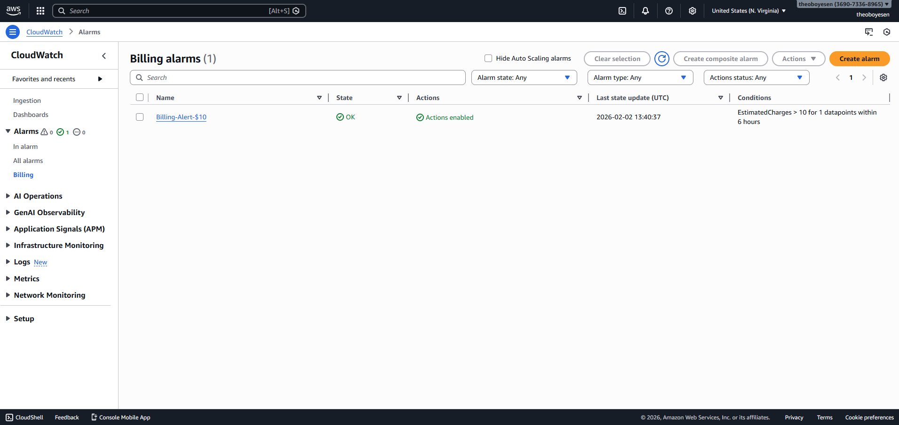
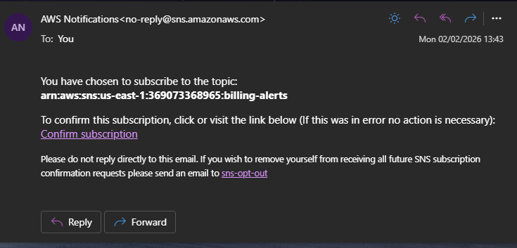
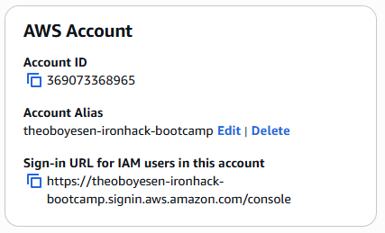
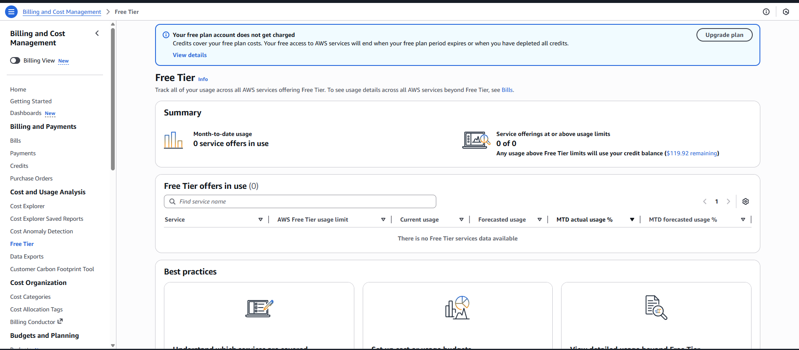

# AWS Account Setup Lab - Solution

**Student Name:** [Your Name]  
**Date Completed:** [Date]

---

## Exercise 1: MFA Configuration

### Screenshot:

### Notes:
- Authenticator app used: [Google Authenticator / Microsoft Authenticator / Authy]
- MFA setup completed successfully: [Yes / No]
- Backup codes saved: [Yes / No]

---

## Exercise 2: Billing Alerts

### Screenshots:

**Billing Preferences:**

**Billing Alarm:**

**SNS Confirmation:**

### Configuration Details:
- Alert threshold: $[amount]
- Email confirmed: [Yes / No]
- Additional thresholds created (bonus): [Yes / No - if yes, list amounts]

---

## Exercise 3: Account Alias

### Screenshot:

### Account Details:
- **Account Alias:** [theoboyesen-ironhack-bootcamp]
- **Sign-In URL:** `https://theoboyesen-ironhack-bootcamp.signin.aws.amazon.com/console`
- **Tested successfully:** [Yes / No]

---

## Exercise 4: Free Tier Dashboard

### Screenshot:

### Current Free Tier Usage Summary:

| Service | Current Usage | Free Tier Limit | Status |
|---------|--------------|-----------------|--------|
| EC2 | [X hours / 750 hours] | 750 hours/month | [Green/Yellow/Red] |
| S3 | [X GB / 5 GB] | 5 GB | [Green/Yellow/Red] |
| [Other services...] | | | |

### Notes:
- Any services approaching limits? [Yes / No - if yes, which ones?]
- Any unexpected usage? [Yes / No - if yes, describe]

---

## Exercise 5: Reflection Questions

### 1. Why is MFA important even for a personal learning account?

**Your Answer:**
MFA reduces the risk of people accessing your account by 99%. Even if someone accessed my personal learning account they can use services outside of the free allowance meaning I would be charged for this.

---

### 2. What would happen if you left your root user unprotected?

**Your Answer:**
Would have full access to my AWS account and could create instances and use other services outside of my free tier. They could also steal sensitive data. I could resolve this by resetting my login details and resetting my MFA details.

---

### 3. How do billing alerts help prevent unexpected charges?

**Your Answer:**
Billing alerts help because you are notified when your charges are exceeding a certain amount delegated by the user. These alerts can be sent through multiple ways such as email. This allows you to make any changes to prevent further charges. This is important as being constantly ontop of billing will help to ensure there are no unexpected charges and also that you are being efficient.

---

### 4. What threshold did you set for your billing alert and why?

**Your Answer:**
I set the amount to $10 as per instructions

---

### 5. What is your account alias and why did you choose it?

It is my name as per instructions, also easy to remember

**Your Answer:**
- **Alias:** theoboyesen-ironhack-bootcamp
- **Reasoning:** It is my name as per instructions, also easy to remember.
---

### 6. What services are you currently using according to the Free Tier dashboard?

**Your Answer:**
N/A

---

## Bonus Challenges Completed (Optional)

### Challenge 1: Multiple Billing Alert Thresholds

- [ ] $5 threshold
- [ ] $25 threshold
- [ ] $50 threshold

**Screenshots (if completed):**
[Add screenshots here]

---

### Challenge 2: CloudTrail Enabled

- [ ] CloudTrail enabled
- [ ] Logging to S3 configured

**Notes:**
[Add any notes about CloudTrail setup]

---

### Challenge 3: AWS Trusted Advisor Reviewed

- [ ] Accessed Trusted Advisor
- [ ] Reviewed recommendations

**Key recommendations found:**
[List any recommendations you found]

---

## Lessons Learned

**What was the most challenging part of this lab?**

[Your answer]

---

**What would you do differently next time?**

[Your answer]

---

**What security practices will you implement going forward?**

[Your answer]

---

## Checklist Before Submission

- [ ] All required screenshots captured and saved
- [ ] Screenshots are clear and show relevant information
- [ ] All reflection questions answered thoroughly
- [ ] Account alias documented
- [ ] Free Tier usage documented
- [ ] Work committed to Git
- [ ] Pull request created
- [ ] PR URL submitted to Student Portal

---

**Lab Completed By:** [Your Name]  
**Date:** [Date]
